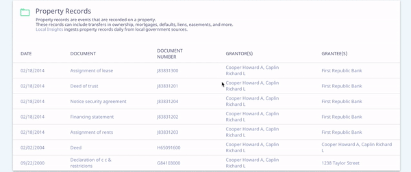

# material-ui-next-responsive-table
[](https://www.npmjs.com/package/material-ui-next-responsive-table)

This project provides read-only responsive table for [Material-UI][material-ui].

Table is shown for desktop screen, list of expandable items - for tablet and mobile.



## Installation
```
npm i --save material-ui-next-responsive-table
```

## Usage

```jsx
import ResponsiveTable from 'material-ui-next-responsive-table'

const columns = [
  {
    key: 'id',
    label: 'ID',
    primary: true,
  },
  {
    key: 'name',
    label: 'Name',
  },
  {
    key: 'authors',
    label: 'Author(s)',
    render: (value) => value.join(', ')
  },
]

const data = [
  {
    id: '1234',
    name: 'Foo',
    authors: ['Andy'],
  },
  {
    id: '4567',
    name: 'Bar',
    authors: ['Joe', 'Mike'],
  }
]

<ResponsiveTable
  columns={columns}
  data={data}
/>
```

## ResponsiveTable Properties
| Name              | Type      | Default        | Description                                            |
| ----------------- | --------- | -------------- | ------------------------------------------------------ |
| columns           | `array`   |                | Array of objects with <br/> * Required column id (`key`) - used for detecting value for body cells <br/> * Required column name (`name`) - shown in table header <br/> * Optional render function (`render: (value, column, row, data)`) - allows to customize cell value for all cells in specific column <br/> * Optional primary boolean (`primary`) - detects the column, which value has to be shown in the expandable list item summary (can be marked for 2 or more columns - in summary they are divided by ` `.|
| data              | `array`   |                | Array of objects with keys that corresponds column id and value that should be shown in cell.|
| noContentText     | `string`  | `'No Content'` | Override the default text if no columns/rows presented.|

## License
The files included in this repository are licensed under the MIT license.

[material-ui]: https://material-ui-next.com/